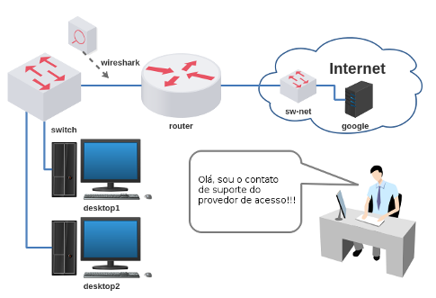

# Atividade 1 - Laboratório Tutorial (revisão)

Este é um laboratório tutorial para que possam compreender (e relembrar) como funciona o LiveLinux.

Objetivo: configurar os desktops para navegar na Internet e capturar as mensagens utilizando a ferramenta Wireshark.

Se precisar pode acompanhar com dois vídeos:

[Tutorial laboratório com Reactos](https://www.youtube.com/watch?v=FLSO8QYKEiI)

[Tutorial laboratório com Slitaz](https://www.youtube.com/watch?v=x3jRjl4rLAc)

**Passo 1**

O laboratório abaixo já está no livelinux: 

**Passo 2**

Abra um terminal e execute o script python:

`$ ls`

`$ cd lab_tutorial`

`$ ls`

`$ py lab.py`

O script solicitará para ser executado como root (senha abc123) e pedirá para preencher o seu nome, então:

`$ sudo py lab.py SeuNome`

Aguarde carregar o laboratório. 

**Passo 3**

Cada um dos dispositivos foram virtualizados de diferentes maneiras: user mode linux, openvswitch ou virtualbox.

Cada dispositivo possui dois botões:
- Superior (cinza ou azul): serve para preparar o dispositivo do zero. (duplo clique para preparar)
- Inferior (vermelho ou verde): serve para carregar o sistema operacional (boot). (duplo clique para carregar) 

Prepare o desktop1 e o desktop2 e depois carregue-os para continuar a atividade. 

**Passo 4**

Agora faça a configuração de rede dos desktops 1 e 2. Siga as instruções do suporte do provedor.

O desktop1 faz a simulação de um ambiente Linux com os Slitaz, já o desktop2 faz a simulação de um ambiente Windows com o ReactOS. 

**Passo 5** 

Carregue o switch e observe o que acontece na medida em que executa o próximo passo. 

**Passo 6**

Carregue a ferramenta Wireshark para capturar mensagens dos desktops.

Através dos desktops faça testes com o comando `ping` para o roteador e depois tente um acesso via navegador web para o site www.google.com (site também é simulado).

Verifique novamente a ferramenta Wireshark e veja se consegue encontrar as informações dos seguintes protocolos:

UDP, IP, HTTP, Ethernet, TCP e DNS. 

Pronto!

Muito bem! :)
