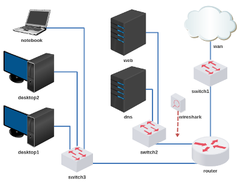

# Atividade 2 - DNS e WEB

Baixe e execute o laboratório no livelinux: 

[lab_atv_2.tar.gz](lab_atv_2.tar.gz)

Vídeos auxiliares: 

[Redes 2 - APNP 01a - DNS e WEB (configuração do laboratório)](https://www.youtube.com/watch?v=MoKdJgovIwk)

[Redes 2 - APNP 01b - DNS e WEB (configuração básica bind)](https://www.youtube.com/watch?v=P4kNPWBbL4M)

[Redes 2 - APNP 02a - DNS e WEB (mensagens DNS - parte 1)](https://www.youtube.com/watch?v=9ie4_r4N0QY)

[Redes 2 - APNP 02b - DNS e WEB (mensagens DNS - parte 2)](https://www.youtube.com/watch?v=2aZPzSvHnkE)

Atividade:
- Configurar endereçamento e roteamento conforme instrução de aula.
- Configurar dns e web conforme instrução de aula. 

Bons estudos!
