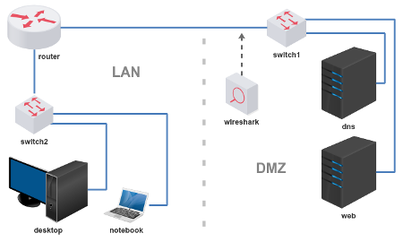

# Trabalho 1 - DNS e WEB

Objetivo: compreender como os servidores DNS e WEB se comunicam com seus serviços clientes. 

**Passo 1**

Carregar o laboratório: 

[lab_trab_1.tar.gz](lab_trab_1.tar.gz)

**Passo 2**

Subdivida o bloco de endereço IP entre LAN e DMZ: 

Sugestão: 100.64.32.0/24

Atribua endereços IPs para o roteador, servidores e estações. 

**Passo 3**

Ative o roteamento no roteador (Linux vem desabilitado por padrão).

Configure a saída padrão (gateway) em todos os dispositivos e faça testes de alcançabilidade (ping).

**Passo 4**

Testes e configurações:

Teste o acesso do Cliente para o Servidor WEB:

`$ (links ou lynx) http://A.B.C.D/`

- sugestão: personalize sua página, reinicie o serviço web

Teste o acesso do Cliente para o Servidor DNS:

`$ dig @A.B.C.E localhost`

- sugestão: reinicie o serviço de DNS

**Passo 5**

Configure o servidor DNS para responder um domínio com o seu nome (ou sobrenome) direcionando ao endereço IP do servidor WEB.

- exemplo: www.seunome.com deve resolver A.B.C.D (ip do servidor web)

**Passo 6**

Teste o acesso do Cliente para o Servidor DNS solicitando resolução de endereço do servidor WEB.

`$ dig @A.B.C.E www.seunome.com A`

Teste o acesso do Cliente ao site através do navegador:

`$ (links ou lynx) http://www.seunome.com/`

**Passo 7**

Se você conseguir executar o passo 6 com sucesso inspecione as mensagens com Wireshark:

1) Mensagem DNS de consulta para resolver www.seunome.com;

2) Mensagem DNS de resposta de www.seunome.com resolvido para o endereço IP do servidor WEB;

3) Mensagem HTTP de acesso - após resolver DNS - no qual se encontra o método GET;

4) Mensagem HTTP na qual trafega a página web - HTTP 200 Ok.

Bom trabalho! :-}
