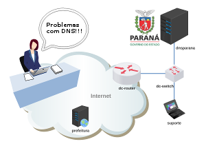

# Validação do Trabalho 1

Esta é uma atividade de validação do trabalho 1 - DNS e WEB.

Objetivo: você é o administrador de domínios do governo do estado, e deverá resolver um problema de DNS.

Faça o download do laboratório e execute como de costume: 

[lab_val_1.tar.gz](lab_val_1.tar.gz)

Resolva o desafio que foi levantado! 

