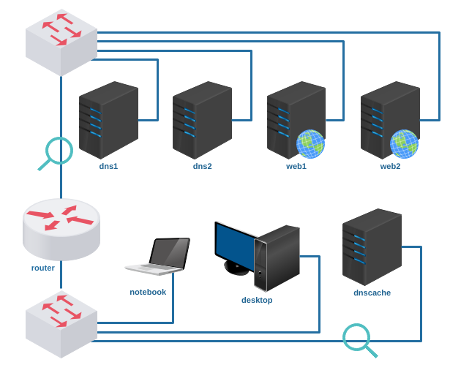

# Atividade 3 - Servidores DNS e WEB

Baixe e execute o laboratório no livelinux: 

[lab_atv_3.tar.gz](lab_atv_3.tar.gz)

Atividade:
- Configurar endereçamento e roteamento conforme instrução de aula.
- Configurar servidores DNS e WEB conforme instrução de aula.

Vídeos auxiliares: 

[Redes 2 - APNP 03a - Servidores DNS (parte 1)](https://www.youtube.com/watch?v=deN1ewxyve0)

[Redes 2 - APNP 03b - Servidores DNS (parte 2)](https://www.youtube.com/watch?v=UGSLgrs8zkE)

[Redes 2 - APNP 03c - Servidores DNS (parte 3)](https://www.youtube.com/watch?v=Mug3H8vesaI)

[Redes 2 - APNP 03d - Servidores DNS (parte 4)](https://www.youtube.com/watch?v=tcNXb83Td6o)

[Redes 2 - APNP 04a - Servidores DNS - Subdomínios (parte 1)](https://www.youtube.com/watch?v=RRQNyMKz9iQ)

[Redes 2 - APNP 04b - Servidores DNS - Subdomínios (parte 2)](https://www.youtube.com/watch?v=NeZ-2xYwtDc)

[Redes 2 - APNP 04c - Servidores DNS - Subdomínios (parte 3)](https://www.youtube.com/watch?v=_aHIR73UiXU)

[Redes 2 - APNP 05a - Servidores DNS - Domínios (parte 1)](https://www.youtube.com/watch?v=uuoFVZq7lT8)

[Redes 2 - APNP 05b - Servidores DNS - Domínios (parte 2)](https://www.youtube.com/watch?v=8_qtsHwxdOg)

[Redes 2 - APNP 06a - Servidores WEB - VirtualHost (parte 1)](https://www.youtube.com/watch?v=PHWDTlcXsVE)

[Redes 2 - APNP 06b - Servidores WEB - VirtualHost (parte 2)](https://www.youtube.com/watch?v=e8BI8v-hJog)

[Redes 2 - APNP 06c - Servidores WEB - VirtualHost (parte 3)](https://www.youtube.com/watch?v=CJO0BsA9xmY)

[Redes 2 - APNP 06d - Servidores WEB - VirtualHost (parte 4)](https://www.youtube.com/watch?v=UqxwQOFym1g)

[Redes 2 - APNP 07a - Servidores DNS - Reverso (parte 1)](https://www.youtube.com/watch?v=Hmvrj9jkJUg)

[Redes 2 - APNP 07b - Servidores DNS - Reverso (parte 2)](https://www.youtube.com/watch?v=-uwun75XnFw)

[Redes 2 - APNP 08a - Servidores DNS - Reverso +subnet (parte 1)](https://www.youtube.com/watch?v=5txuxTN7sGY)

[Redes 2 - APNP 08b - Servidores DNS - Reverso +subnet (parte 2)](https://www.youtube.com/watch?v=ayF1dw3HU58)

[Redes 2 - APNP 08c - Servidores DNS - Reverso +subnet (parte 3)](https://www.youtube.com/watch?v=o_JGqrRGav4)

[Redes 2 - APNP 09a - Servidores DNS - Master/Slave (parte 1)](https://www.youtube.com/watch?v=lKn8K5_OIGY)

[Redes 2 - APNP 09b - Servidores DNS - Master/Slave (parte 2)](https://www.youtube.com/watch?v=H3QiGB5kZdc)

[Redes 2 - APNP 09c - Servidores DNS - Master/Slave (parte 3)](https://www.youtube.com/watch?v=3oBBv5Rvi1g)

Bons estudos!

