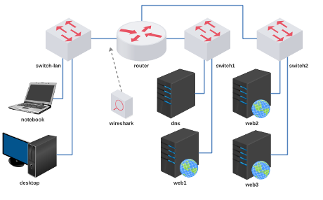

#  Trabalho 2 - Serviço DNS

Enunciado: configurar o servidor DNS para resolver o nome de três websites.

Objetivo: compreender como o servidor DNS pode gerenciar diferentes zonas e domínios.

Faça o download do laboratório e execute no LiveLinux.

[lab_trab_2.tar.gz](lab_trab_2.tar.gz)

**Passo 1**

Endereçar e alcançar todos os dispositivos.

Faça a subdivisão do seu bloco de endereço IP:

Sugestão: 198.51.100.0/24

**Passo 2**

Escolha um domínio (sugestão):
- bmw
- dafra
- ducati
- harley-davidson
- honda
- kasinski
- kawasaki
- piaggio
- sundown
- suzuki
- triumph
- viper
- yamaha
- ...

**Passo 3**

Faça uma página para cada um dos domínios abaixo em um servidor web diferente:

web1 - (www.)dominioescolhido.com

web2 - (www.)dominioescolhido.net

web3 - (www.)dominioescolhido.org

Importante: o mesmo site deve ser acessível sem e com o "www".

**Passo 4**

Configure o servidor DNS para permitir o acesso para cada um dos sites.

**Passo 5**

Acesse as páginas com o navegador Mozilla Firefox do Desktop.

**Passo 6**

Utilize a ferramenta wireshark e inspecione:

a) Mensagem de consulta de DNS para o domínio "www.dominioescolhido.net";

b) Mensagem de resposta de DNS cuja consulta foi feita para o domínio "www.dominioescolhido.net";

c) Mensagem de solicitação de HTTP para o site "http://dominioescolhido.org";

d) Mensagem de HTTP em resposta à solicitação pelo site "http://dominioescolhido.org".

Bom trabalho! :-}

