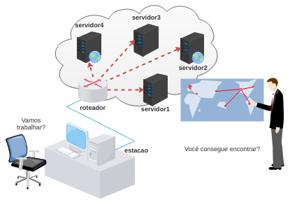

# Validação do Trabalho 2

Esta é uma atividade de validação do trabalho 2 - Serviço DNS.

Objetivo: você é um candidato à uma vaga de emprego em uma multinacional, o avaliador irá lançar um desafio e você deverá responder.

Faça o download do laboratório e execute como de costume: 

[lab_val_2.tar.gz](lab_val_2.tar.gz)

Resolva o desafio que foi levantado! 

