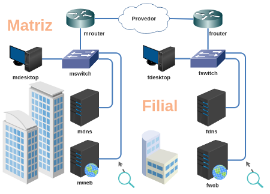

# Trabalho 3 - DNS, Reverso e VHosts

Enunciado: você é o responsável pelos servidores DNS e WEB de uma certa empresa. Essa empresa possui servidores na matriz e na filial que precisam ser configurados com seu domínio DNS (incluindo o reverso) e suas páginas WEB.

Objetivo: compreender como o servidor DNS pode delegar domínios; compreender o funcionamento do DNS reverso; e, também, compreender como diferentes domínios em diferentes sites podem ser configurados em um mesmo servidor WEB.

Faça o download do laboratório e execute no livelinux xbnet. 

[lab_trab_3.tar.gz](lab_trab_3.tar.gz)

**Passo 1**

Endereçar e alcançar todos os dispositivos.

Faça a subdivisão do seu bloco de endereço IP:

Sugestão: 203.0.113.0/24.

**Passo 2**

Escolha um domínio (.com.br), sugestão:
- boticario
- casasbahia
- havan
- magazineluiza
- natura
- pernambucanas
- pontofrio
- riachuelo
- saraiva
- submarino
- tigre
- tramontina
- votorantim
- walmart
- ...

**Passo 3**

Configure o servidor DNS da Matriz (mdns) para que seja autoridade do domínio empresa.com. (ou empresa.com.br)

**Passo 4**

Configure o servidor DNS da Matriz (mdns) para que seja autoridade do bloco de endereço IP para resolução de DNS reverso.

**Passo 5**

Todos os endereços IPs dos dispositivos da Matriz deverão ter um nome.empresa.com e resolução reversa. Configure isso no servidor mdns.

Todos os dispositivos da Matriz devem ter a capacidade de consultar e resolver esses nomes de domínio.

**Passo 6**

Configure os servidores WEB e DNS da Matriz (mdns e mweb) para resolver para a mesma página de entrada quando um usuário digitar em seu navegador:

http://empresa.com e http://www.empresa.com deverão apresentar a mesma página.

**Passo 7**

O servidor DNS da Matriz deverá ser o servidor DNS Raiz para o servidor DNS da Filial.

Sugestão: aqui você já pode testar o DNS da Filial como DNS Cache dos dispositivos da própria Filial e tentar o acesso ao site hospedado na Matriz.

**Passo 8**

A Matriz deverá delegar a autoridade do subdomínio filial.empresa.com para o servidor DNS da Filial (fdns).

Obs: não precisa ser necessariamente este nome (filial), pode ser um outro nome fictício (exemplo: cidade ou região).

**Passo 9**

A Matriz deverá delegar a autoridade de resolução reversa do bloco de endereço IP da Filial para o próprio servidor DNS da Filial (fdns).

**Passo 10**

Todos os endereços IPs dos dispositivos da Filial deverão ter um nome.filial.empresa.com e resolução reversa. Configure isso no servidor fdns.

Todos os dispositivos da Filial devem ter a capacidade de consultar e resolver esses nomes de domínio.

**Passo 11**

A Filial (fdns) deverá criar três subdomínios que deverão ser configurados como VirtualHosts no servidor fweb:

http://produtos.filial.empresa.com (página simples para dizer que é uma seção de produtos)

http://cadastro.filial.empresa.com (página simples para dizer que é um cadastro do visitante)

http://contato.filial.empresa.com (página simples para o visitante saber entrar em contato com a filial)

**Passo 12**

Faça alguns testes, os dispositivos mdesktop e fdesktop deverão acessar tanto o site da matriz como os sites da filial.

Bom trabalho! :-}
