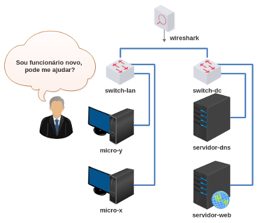

# Validação do Trabalho 3

Esta é uma atividade de validação do trabalho 3 - DNS, Reverso e VHosts.

Enunciado: você é um funcionário de TI que gerencia o ambiente de intranet de uma Cooperativa. Chegou um funcionário novo na empresa e você deverá ajudá-lo.

Faça o download do laboratório e execute como de costume: 

[lab_val_3.tar.gz](lab_val_3.tar.gz)

Resolva o desafio que foi levantado! 
