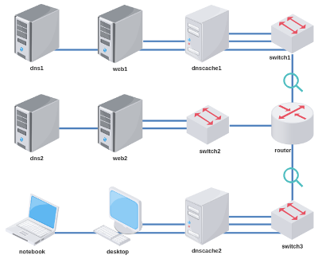

# Atividade 4 - Redundância DNS e WEB

Baixe e execute o laboratório no livelinux: 

[lab_atv_4.tar.gz](lab_atv_4.tar.gz)

Atividade:
- Configurar endereçamento e roteamento conforme instrução de aula.
- Configurar servidores DNS e WEB conforme instrução de aula.

Vídeos auxiliares:

[Redes 2 - APNP 10a - Redundância DNS/WEB (parte 1)](https://www.youtube.com/watch?v=vbySMljS0vY)

[Redes 2 - APNP 10b - Redundância DNS/WEB (parte 2)](https://www.youtube.com/watch?v=Ul56IsbIvYs)

[Redes 2 - APNP 10c - Redundância DNS/WEB (parte 3)](https://www.youtube.com/watch?v=DDdxnAWvYaY)

[Redes 2 - APNP 10d - Redundância DNS/WEB (parte 4)](https://www.youtube.com/watch?v=iEBDypB73KA)

Bons estudos!

