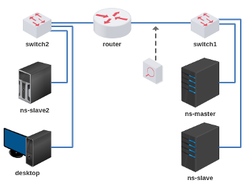

#  Trabalho 4 - DNS Master/Slave

Objetivo: compreender como funciona a comunicação entre servidores DNS Master e Slave.

Enunciado: configurar um servidor DNS master para responder um domínio e replicar a sua configuração em dois servidores DNS slaves.

**Passo 1**

Baixar o script e executar: 

[lab_trab_4.tar.gz](lab_trab_4.tar.gz)

**Passo 2**

Endereçar dispositivos e testar alcançabilidade.

**Passo 3**

Escolha um nome de domínio qualquer.

**Passo 4**

Configurar o servidor ns-master como servidor DNS master do seu domínio. 

**Passo 5**

Configurar os servidores ns-slave e ns-slave2 como servidores slaves do seu domínio. 

**Passo 6**

Ative o Wireshark para capturar mensagens DNS entre o DNS Master e o DNS Slave2. 

**Passo 7**

Adicione uma entrada qualquer ao seu domínio, por exemplo, um endereço IP para desktop.seunome.net. Verifique se a modificação foi automática para os servidores DNS slaves.

Lembrete: número serial. 

**Passo 8**

Volte ao Wireshark e encontre a mensagem DNS na qual o DNS Master forneceu essa nova entrada (do passo 7) para o DNS Slave2. 

Verifique e responda: a mensagem DNS capturada foi encapsulada em qual protocolo da camada 4? 

Bom trabalho! :-}

