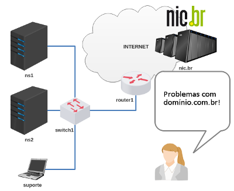

# Validação do Trabalho 4

Esta é uma atividade de validação do trabalho 4 - DNS Master/Slave.

Enunciado: você é responsável pelos servidores DNS de uma certa empresa e deverá resolver um problema levantado pela autoridade .BR, visto que o seu domínio é um ".com.br" e para funcionar depende das instruções deles.

[lab_val_4.tar.gz](lab_val_4.tar.gz)

Resolva o desafio que foi levantado! 
