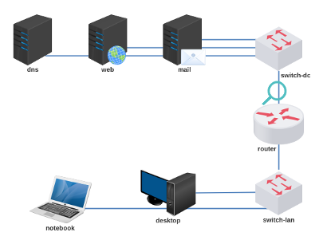
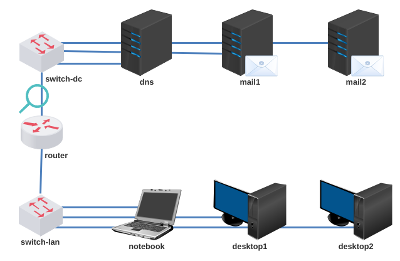

# Atividade 5 - Servidores DNS/WEB/MAIL

Baixe e execute o laboratório no livelinux: 

[lab_atv_5.tar.gz](lab_atv_5.tar.gz)

Laboratório modificado para Mail Relay: 

[lab_atv_5b.tar.gz](lab_atv_5b.tar.gz)

Atividade:

- Configurar endereçamento e roteamento conforme instrução de aula.
- Configurar dns, web e mail conforme instrução de aula.

Videoaulas:

[Redes 2 - APNP 11a - Servidor E-mail (parte 1)](https://www.youtube.com/watch?v=XDzwx41wRYg)

[Redes 2 - APNP 11b - Servidor E-mail (parte 2)](https://www.youtube.com/watch?v=ZxPMR6H0WZc)

[Redes 2 - APNP 11c - Servidor E-mail (parte 3)](https://www.youtube.com/watch?v=YQL8Cx4u36M)

[Redes 2 - APNP 12a - E-mail (Servidor + Cliente) (parte 1)](https://www.youtube.com/watch?v=kycBGncD_U8)

[Redes 2 - APNP 12b - E-mail (Servidor + Cliente) (parte 2)](https://www.youtube.com/watch?v=gKMzwyOz6OQ)

[Redes 2 - APNP 12c - E-mail (Servidor + Cliente) (parte 3)](https://www.youtube.com/watch?v=Uak2VtxFCxc)

[Redes 2 - APNP 13a - Servidores E-mail +Relay (parte 1)](https://www.youtube.com/watch?v=xqGG47HuJlA)

[Redes 2 - APNP 13b - Servidores E-mail +Relay (parte 2)](https://www.youtube.com/watch?v=TsvGZK6As2k)

[Redes 2 - APNP 13c - Servidores E-mail +Relay (parte 3)](https://www.youtube.com/watch?v=w-0tZVoxmQI)

Bons estudos!
