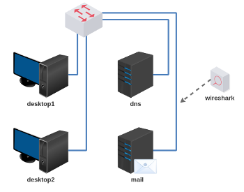
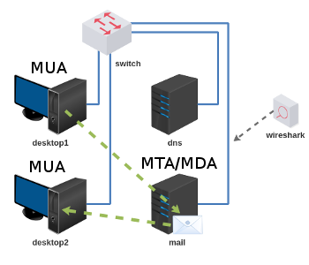

# Trabalho 5 - Servidor de E-mail

Objetivo: Compreender como um servidor de E-mail recebe (MTA) e guarda (MDA) os e-mails, e como um cliente de E-mail (MUA) busca seus e-mails de um servidor (MDA).

Enunciado: Configurar os servidores de E-mail e DNS para que o Mozilla Thunderbird possa enviar e receber um e-mail. Durante este processo capturar a mensagem SMTP e a mensagem POP3.

**Passo 1**

Carregar a topologia: 

[lab_trab_5.tar.gz](lab_trab_5.tar.gz)

**Passo 2**

Endereçar e verificar se os dispositivos estão alcançando entre si.

**Passo 3**

Faça a configuração do servidor DNS e dos clientes DNS.

**Passo 4**

Configure os servidores Postfix e Courier para interagirem no armazenamento de e-mails (Maildir).

**Passo 5**

Configure o servidor Postfix para receber e-mails com o seu domínio.

Sugestão: remover todas as configurações TLS do Postfix. Isso evitará que a configuração automática do Thunderbird ative SMTP com TLS.

**Passo 6**

Crie dois usuários no seu servidor de e-mail, exemplo:

Usuário 1: fulano@empresa.com.br

Usuário 2: beltrano@empresa.com.br

Obs: fulano e beltrano são apenas exemplos, pode utilizar outros nomes de usuários.

**Passo 7**

Configure a ferramenta Mozilla Thunderbird do desktop1 para o usuário 1. (ex: fulano)

Configure a ferramenta Mozilla Thunderbird do desktop2 para o usuário 2. (ex: beltrano)

Observar quais domínios estão faltando para o Mozilla Thunderbird fazer a configuração automaticamente. Se estiver faltando, faça esta configuração no servidor DNS. 

**Passo 8**

Envie um e-mail via desktop 1 do usuário 1 (fulano) para o usuário 2 (beltrano), e capture a mensagem de e-mail com a ferramenta Wireshark. 

**Passo 9**

Faça o download do e-mail do Passo 8 via desktop 2 do usuário 2 (beltrano), e capture a mensagem de e-mail com a ferramenta Wireshark.

**Passo 10**

Inspecione as seguintes informações:

a) A mensagem SMTP capturada via Wireshark. (sugestão, a mensagem aparece como IMF no Wireshark); 

b) A mensagem POP3 capturada via Wireshark. (sugestão, a mensagem vem logo após de um RETR do POP3); 

c) O código-fonte do e-mail que foi recebido pelo destinatário. É possível salvar o código-fonte do e-mail em um arquivo texto utilizando o Thunderbird. 

Bons trabalho! :-}
