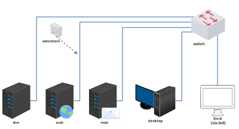

# Trabalho 6 - Formulário Web+Mail

Objetivo: compreender como um servidor SMTP pode ser utilizado como relay para uma aplicação WEB.

Enunciado: fazer uma página de contato MUA que irá enviar um e-mail para um servidor MTA.

**Passo 1)**

Carregar a topologia: 



[lab_trab_6.tar.gz](lab_trab_6.tar.gz)

*Importante: o servidor web possui o PHP PEAR instalado para permitir o envio de e-mails.*

**Passo 2)**

Endereçar os servidores e a bridge e verificar se estão se comunicando (ping).

Nota: o hospedeiro pode se comunicar com os servidores através da interface "br0". Para endereçar, exemplo: `sudo ifconfig br0`.

**Passo 3)**

Escolha uma empresa e utilize o domínio, sugestão:
- Bob's
- Burger King
- Casa do Pão de Queijo
- China in Box
- Giraffas
- Habib's
- KFC
- Madero
- McDonald's
- Pizza Hut
- Spoleto
- Starbucks
- SubWay
- Taco Bell
- ...

**Passo 4)**

Configurações no servidor de E-mail:
- Remova as configurações TLS do servidor Postfix. (não utilizaremos)
- Configure os servidores Postfix e Courier para interagirem no armazenamento de e-mails (Maildir).
- Configure o servidor Postfix para receber e-mails com o seu domínio.
- Crie um usuário no servidor de Mail para receber os e-mails de contato da empresa. Exemplo: contato@empresa.com.br

**Passo 5)**

Crie uma página WEB de contato da empresa:
- A página deverá ter um logotipo da empresa PNG ou JPG.
- A página deverá permitir o preenchimento de 4 campos: Nome da Pessoa, E-mail da Pessoa, Assunto do Contato e o Texto do Contato.
- Ao ser preenchida, a página deverá enviar toda a informação em formato de e-mail para o contato criado no passo 4.
- Faça a página utilizando Apache2 + PHP5 + PHP PEAR.

Sugestão: é possível codificar e testar o código php via linha de comando no próprio servidor web.

Um exemplo: [PHP PEAR Mail](https://www.authsmtp.com/php-pear-mail/)

**Passo 6)**

Envie seus arquivos (código-fonte e figuras) via FTP para o usuário estudante no servidor web.

O hospedeiro possui cliente FTP na linha de comando ou através do gerenciador de arquivos. 

Exemplo:

```
hospedeiro$ ftp 200.0.X.Y
-> estudante
-> abc123
ftp> put logotipo.png
```

```
web# ls /home/estudante
-> aparecerá o arquivo logotipo.png
```

**Passo 7)**

Configure a ferramenta Mozilla Thunderbird para fazer download dos e-mails do seu usuário via POP3 ou IMAP.

Sugestão: você pode utilizar a ferramenta Mozilla Thunderbird do desktop ou do hospedeiro. No caso do hospedeiro você precisará modificar o servidor DNS de consulta (editar resolv.conf).

**Passo 8)**

Coloque seu ambiente de Contato Web+E-mail em funcionamento:

a) Acesse o formulário via WEB;

b) Preencha as informações no formulário e envie;

c) Abra o Mozilla Thunderbird e faça download dos e-mails;

d) Verifique se o e-mail preenchido via WEB chegou com sucesso. 

Bom trabalho!

