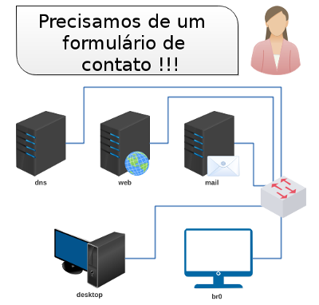

# Validação do Trabalho 6

Esta é uma atividade de validação do trabalho 6 - Formulário Web com E-mail. 

Enunciado: O seu formulário de contato foi adquirido por uma livraria. Instale o seu formulário juntamente com o logotipo da própria livraria (veja pasta logos) no site da livraria. Todo o ambiente já está configurado, basta apenas enviar o seu código e logotipo e testar. 

[lab_val_6.tar.gz](lab_val_6.tar.gz) -> observe que há uma pasta "logos".

Bom trabalho!
