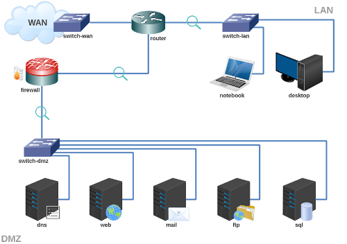

# Atividade 6 - Firewall

Baixe e execute o laboratório no livelinux: 

[lab_atv_6.tar.gz](lab_atv_6.tar.gz) <- Completo para RAM >= 6GB.

[lab_atv_6b.tar.gz](lab_atv_6b.tar.gz) <- Otimizado para 4GB RAM (carregue um servidor a menos na DMZ).

Videoaulas:

[Redes 2 - APNP 15a - Laboratório Firewall](https://www.youtube.com/watch?v=_xEtrb9rv48)

[Redes 2 - APNP 15b - Firewall +bloqueios (parte 1)](https://www.youtube.com/watch?v=qAKD2C1ZIqQ)

[Redes 2 - APNP 15c - Firewall +bloqueios (parte 2)](https://www.youtube.com/watch?v=o-s68ycMLBs)

[Redes 2 - APNP 16a - Firewall +lista_branca (parte 1)](https://www.youtube.com/watch?v=JVOHXj9_dAA)

[Redes 2 - APNP 16b - Firewall +lista_branca (parte 2)](https://www.youtube.com/watch?v=eys2uwwLhMg)

[Redes 2 - APNP 17a - Firewall +stateful (parte 1)](https://www.youtube.com/watch?v=Oh3Z_7bk_Ow)

[Redes 2 - APNP 17b - Firewall +stateful (parte 2)](https://www.youtube.com/watch?v=8uqFRyzB7Rc)

[Redes 2 - APNP 17c - Firewall +stateful (parte 3)](https://www.youtube.com/watch?v=5l8-pM8mRaU)

Bons estudos!

