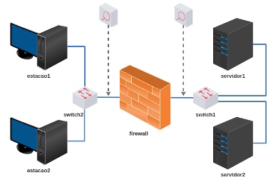

# Trabalho 7 - Firewall

Enunciado: você é o administrador de um Firewall que dá acesso à uma DMZ. Sua função é configurar os controles de acesso corretamente.

Objetivo: compreender como os serviços de Internet se comunicam e fazer controle de acesso com um Firewall.

**Passo 1)**

Carregar a topologia: 

[lab_trab_7.tar.gz](lab_trab_7.tar.gz)

**Passo 2)**

Endereçar Estações, Servidores e Firewall.

Todos os dispositivos deverão estar alcançáveis entre si. (ping)

**Passo 3)**

Testar acesso de serviços das estações para os servidores:
- DNS
- TFTP
- TELNET
- HTTP
- SSH

**Passo 4) - Lista Negra**

O firewall deverá proteger o servidor2 obedecendo às seguintes regras:

a) A LAN não poderá acessar TELNET no servidor2

b) A estação2 estará proibida de acessar HTTP no servidor2

c) A estação1 estará proibida de acessar TFTP no servidor2

d) A LAN estará autorizada para acessar os demais serviços do servidor2

**Passo 5) - Lista Branca**

O firewall deverá proteger o servidor1 obedecendo às seguintes regras:

a) A estação2 poderá acessar SSH no servidor1

b) A LAN poderá consultar DNS no servidor1

c) A LAN estará proibida de acessar os demais serviços do servidor1

**Passo 6)**

Execute testes de acesso e inspecione os registros de log do Firewall para melhor aprendizado.

Bom trabalho!

