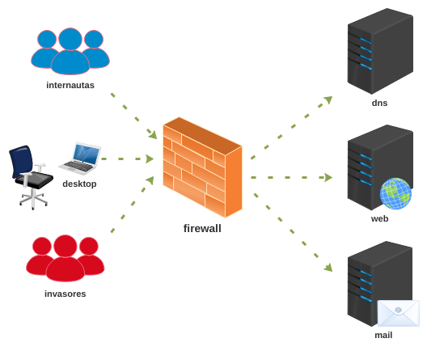

# Validação do Trabalho 7

Esta é uma atividade de validação do trabalho 7 - Firewall. 

Enunciado: Você é responsável pelo gerenciamento do firewall e da DMZ de uma loja online, proteja os servidores de invasores e libere acesso para os internautas. 

**Passo 1**

Faça o download do laboratório e execute como de costume: 

[lab_val_7.tar.gz](lab_val_7.tar.gz)

**Passo 2**

a) Carregue todos os dispositivos.

b) Verifique o site via desktop usando o navegador web. (Ex.: www.site.com)

c) Se o site estiver hackeado, arrume. O site deve conter no mínimo uma mensagem de boas vindas juntamente com o e-mail de contato para ser considerado normal.

d) Configure e receba os e-mails de contato para sua análise, exemplo: contato@site.com senha abc123.

e) Para cumprir a atividade os internautas devem estar todos satisfeitos **"emoticon = :)"** e os invasores todos furiosos **"emoticon = >:("**. 

Boa prova!

